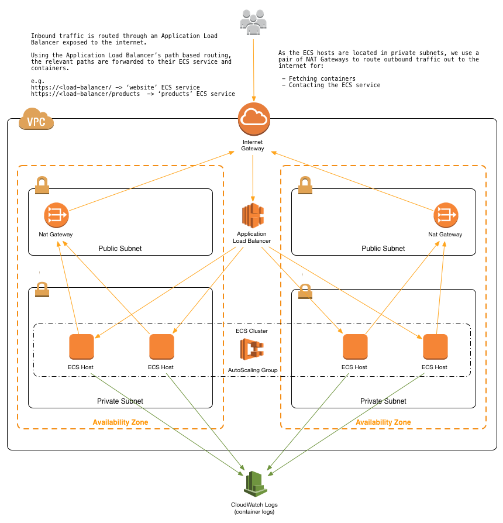
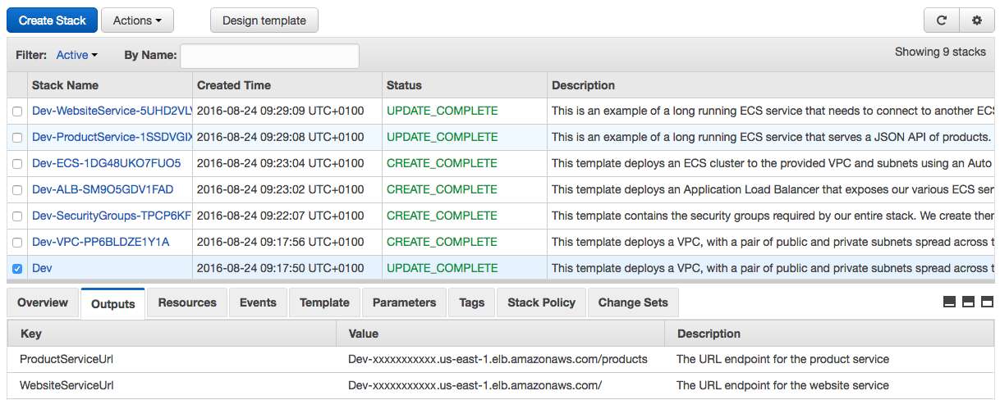

# Deploying Microservices with Amazon ECS and AWS CloudFormation (with a sprinkle of ALB too)

This set of YAML [AWS CloudFormation](https://aws.amazon.com/cloudformation/) templates provides an reference architecture for deploying microservices to [Amazon EC2 Container Service (Amazon ECS)](http://docs.aws.amazon.com/AmazonECS/latest/developerguide/Welcome.html) with [AWS CloudFormation](https://aws.amazon.com/cloudformation/).

You can use this button to launch this [AWS CloudFormation](https://aws.amazon.com/cloudformation/) stack into your account:

[](https://console.aws.amazon.com/cloudformation/home?region=us-east-1#/stacks/new?stackName=Production&templateURL=https://amazonecs-reference-architectures.s3-us-east-1.amazonaws.com/cloudformation/master.yaml)  

## Overview



The repository consists of a set of nested templates that will deploy:

 - A tiered [VPC](http://docs.aws.amazon.com/AmazonVPC/latest/UserGuide/VPC_Introduction.html) with public and private subnets, spanning an AWS region.
 - A highly available [Amazon EC2 Container Service (ECS)](https://aws.amazon.com/ecs/) cluster deployed across two [Availability Zones (AZs)](http://docs.aws.amazon.com/AWSEC2/latest/UserGuide/using-regions-availability-zones.html) in an [Auto Scaling Group](https://aws.amazon.com/autoscaling/).
 - A pair of [NAT Gateways](http://docs.aws.amazon.com/AmazonVPC/latest/UserGuide/vpc-nat-gateway.html) (one in each AZ) to handle outbound traffic.
 - Two interconnecting microservices deployed as [Amazon ECS services](http://docs.aws.amazon.com/AmazonECS/latest/developerguide/ecs_services.html) (website-service and product-service). 
 - An [Application Load Balancer (ALB)](https://aws.amazon.com/elasticloadbalancing/applicationloadbalancer/) to the public subnets to handle inbound traffic.
 - ALB path based routes for each Amazon ECS service to route the inbound traffic to the correct Amazon ECS service.
 - Centralised container logging with [Amazon CloudWatch Logs](http://docs.aws.amazon.com/AmazonCloudWatch/latest/logs/WhatIsCloudWatchLogs.html).

## Amazon EC2 Container Service (Amazon ECS)

Amazon EC2 Container Service (ECS) is a highly scalable, high performance container management service that supports Docker containers and allows you to easily run applications on a managed cluster of Amazon EC2 instances. Amazon ECS eliminates the need for you to install, operate, and scale your own cluster management infrastructure. With simple API calls, you can launch and stop Docker-enabled applications, query the complete state of your cluster, and access many familiar features like security groups, Elastic Load Balancing, EBS volumes, and IAM roles. You can use Amazon ECS to schedule the placement of containers across your cluster based on your resource needs and availability requirements. You can also integrate your own scheduler or third-party schedulers to meet business or application specific requirements.

Here are some of the key benefits of using Amazon ECS...

#### Fully Managed

Amazon ECS is a **managed** container management engine. Rather than run a container management engine / scheduler yourself, with Amazon ECS you can leave undifferentiated heavy lifting to AWS while you focus on things that differentiate your business and add value.

#### Open Source Agent

The container agent runs on each instance within an Amazon ECS cluster. Typically, it runs as a container itself and registers the hosts with Amazon ECS. It sends information about the instance's current running tasks and resource utilization to Amazon ECS, and starts and stops tasks whenever it receives a request from Amazon ECS. For more information, see [Amazon ECS Container Agent](http://docs.aws.amazon.com/AmazonECS/latest/developerguide/ECS_agent.html).

For simplicity, we recommend that you use one of the [pre-configured and optimised AMIs](http://docs.aws.amazon.com/AmazonECS/latest/developerguide/ecs-optimized_AMI.html) that can be launched into Amazon EC2 (as this set of templates does), but you always have the option to [manually deploy the agent](http://docs.aws.amazon.com/AmazonECS/latest/developerguide/ecs-agent-install.html) if you wish. 

The source code for the Amazon ECS container agent is available on GitHub. We encourage you to submit pull requests for changes that you would like to have included.

You can find the project on GitHub here: 
[https://github.com/aws/amazon-ecs-agent](https://github.com/aws/amazon-ecs-agent) 
 
#### Extensible 

Amazon ECS provides a default container scheduler that can deploy short running tasks (e.g. a one-off job), or long running services (e.g. a web service).

If you require something more tailored to your needs, check out this blog post that shows how you can create your own custom schedulers for Amazon ECS:
[https://aws.amazon.com/blogs/compute/how-to-create-a-custom-scheduler-for-amazon-ecs/](https://aws.amazon.com/blogs/compute/how-to-create-a-custom-scheduler-for-amazon-ecs/)

We also have an example implementation of a custom scheduler that integrates Apache Mesos with Amazon ECS:
[https://github.com/awslabs/ecs-mesos-scheduler-driver](https://github.com/awslabs/ecs-mesos-scheduler-driver)
 
#### Strong integration with AWS services

 - Integrate identity and access management with [AWS IAM](http://docs.aws.amazon.com/IAM/latest/UserGuide/getting-setup.html) to control who/what can interact and manage your cluster.
 - Create granular [IAM Roles](http://docs.aws.amazon.com/AmazonECS/latest/developerguide/IAM_policies.html) to allow secure access from your containers/tasks/services to other AWS services.
 - Audit logging with [AWS CloudTrail](https://aws.amazon.com/cloudtrail/).
 - Centralised container logging with [AWS CloudWatch Logs](https://aws.amazon.com/cloudwatch/).
 - Per cluster or per task/service metrics and monitoring with [AWS CloudWatch](https://aws.amazon.com/cloudwatch/).
 - Integration with Auto Scaling Groups to create a scalable pool of compute for your Amazon ECS cluster. 
 - ... and much more! 

#### Further reading

This YouTube video provides a great insight into getting started with Amazon ECS:

[](https://www.youtube.com/watch?v=eun8CqGqdk8)

You can also learn how [Coursera](https://www.coursera.org/) moved to a microservices-based architecture with Amazon ECS: 

[https://aws.amazon.com/solutions/case-studies/coursera-ecs/](https://aws.amazon.com/solutions/case-studies/coursera-ecs/)


## Why use AWS CloudFormation with Amazon ECS?

Using AWS CloudFormation to deploy and manage services with Amazon ECS has a number of nice benefits over more traditional methods (cli, scripting etc). For example:

#### Infrastructure-as-Code

A template can be used repeatedly to create identical copies of the same stack (or to use as a foundation to start a new stack).  Templates are simple YAML or JSON-formatted text files that can be placed under your normal source control mechanisms, stored in private or public locations such as Amazon S3, and exchanged via email. With AWS CloudFormation, you can "open the hood," to see exactly which AWS resources make up a stack. You retain full control and have the ability to modify any of the AWS resources created as part of a stack. 

#### Self Documenting 

Fed up of out dated documentation on your infrastructure / environments? Still keep manual documentation of IP ranges, security group rules etc?

With AWS CloudFormation, your template becomes your documentation. Want to see exactly what you have deployed? Just look at your template. If you keep it in source control then you can also look back at exactly which changes were made and by whom.

#### Intelligent Updating & Rollback

AWS CloudFormation not only handles the initial deployment of your infrastructure and environment(s), but it can also manage the whole lifecycle including future updates. During updates you have fine grained control and visibility over how changes are applied, using functionality such as [Change Sets](https://aws.amazon.com/blogs/aws/new-change-sets-for-aws-cloudformation/), [Rolling Update Policies](http://docs.aws.amazon.com/AWSCloudFormation/latest/UserGuide/aws-attribute-updatepolicy.html) and [Stack Policies](http://docs.aws.amazon.com/AWSCloudFormation/latest/UserGuide/protect-stack-resources.html).

## Template Details

The templates below are included in this repository and reference architecture:

| Template | Description |
| --- | --- | 
| [master.yaml](master.yaml) | This is the master template - deploy to to CloudFormation and it will include all of the others automatically. |
| [infrastructure/vpc.yaml](infrastructure/vpc.yaml) | This template deploys a [VPC](http://docs.aws.amazon.com/AmazonVPC/latest/UserGuide/VPC_Introduction.html) with a pair of public and private subnets spread across two [Availability Zones (AZs)](http://docs.aws.amazon.com/AWSEC2/latest/UserGuide/using-regions-availability-zones.html). It deploys an [Internet Gateway](http://docs.aws.amazon.com/AmazonVPC/latest/UserGuide/VPC_Internet_Gateway.html), with a default route on the public subnets. It deploys a pair of [NAT Gateways](http://docs.aws.amazon.com/AmazonVPC/latest/UserGuide/vpc-nat-gateway.html) (one in each AZ), and default routes for them in the private subnets. |
| [infrastructure/security-groups.yaml](infrastructure/security-groups.yaml) | This template contains the [security groups](http://docs.aws.amazon.com/AmazonVPC/latest/UserGuide/VPC_SecurityGroups.html) required by our entire stack. We create them in a separate nested template, so they can be referenced by all of the other nested templates. |
| [infrastructure/load-balancers.yaml](infrastructure/load-balancers.yaml) | This template deploys an [Application Load Balancer (ALB)](https://aws.amazon.com/elasticloadbalancing/applicationloadbalancer/) to the public subnets that exposes our various Amazon ECS services. We create it in a separate nested template, so it can be referenced by all of the other nested templates and our various Amazon ECS services can register with it. |
| [infrastructure/ecs-cluster.yaml](infrastructure/ecs-cluster.yaml) | This template deploys an Amazon ECS cluster to the private subnets using an [Auto Scaling Group](https://aws.amazon.com/autoscaling/) |
| [services/product-service.yaml](infrastructure/product-service.yaml) | This is an example of a long running Amazon ECS service that serves a JSON API of products. You can find the full source for the service here: [https://github.com/paulmaddox/ecs-demo-product-service](https://github.com/paulmaddox/ecs-demo-product-service)|
| [services/website-service.yaml](infrastructure/website-service.yaml) | This is an example of a long running Amazon ECS service that needs to connect to another service (the product-service) via it's load balanced URL. We use an environment variable to pass the URL of the product-service to the container(s). You can find the full source for this service here: [https://github.com/paulmaddox/ecs-demo-website-service](https://github.com/paulmaddox/ecs-demo-website-service) |

Once the CloudFormation templates have been deployed, the [stack outputs](http://docs.aws.amazon.com/AWSCloudFormation/latest/UserGuide/outputs-section-structure.html) will contain a link to the load balanced URLs for each of the deployed microservices:



## How do I...?

### Get started and deploy this into my AWS account

You can use this button to launch this [AWS CloudFormation](https://aws.amazon.com/cloudformation/) stack into your account:

[](https://console.aws.amazon.com/cloudformation/home?region=us-east-1#/stacks/new?stackName=Production&templateURL=https://amazonecs-reference-architectures.s3-us-east-1.amazonaws.com/cloudformation/master.yaml)    

### Customise the templates

1. Fork this GitHub repository ([direct link](https://github.com/awslabs/ecs-refarch-cloudformation#fork-destination-box))
2. Clone the forked GitHub repository to your local machine
3. Modify the templates
4. Upload them to an Amazon S3 bucket of your choice
5. Either create a new AWS CloudFormation stack by deploying emaster.yaml template, or update your existing stack with your version of the templates.

### Create a new Amazon ECS service

1. Push your container to a registry somewhere (eg: [Amazon EC2 Container Registry](https://aws.amazon.com/ecr/)).
2. Copy one of the existing service templates in [services/*](/services).
3. Update the `ContainerName` and `Image` parameters to point to your container image instead of the example container.
4. Increment the `ListenerRule` priority number (no two services can have the same priority number - this is used to order the ALB path based routing rules)
5. Copy one of the existing service definitions in [master.yaml](master.yaml) point it at your new service template. Specify the HTTP `Path` that you want the service exposed at. 
6. Deploy the templates as a new stack, or as an update to an existing stack.

### Setup centralized container logging

By default, the containers in your Amazon ECS tasks/services will already be configured to send log information to [Amazon CloudWatch Logs](http://docs.aws.amazon.com/AmazonCloudWatch/latest/logs/WhatIsCloudWatchLogs.html) and retain them for 365 days. Within each service's template (in [services/*](services/)), a LogGroup is created named after the CloudFormation stack's name. All container logs will be sent to that CloudWatch Logs log group.

You can view the logs by looking in your [CloudWatch Logs console](https://console.aws.amazon.com/cloudwatch/home?#logs:) (make sure you are in the correct AWS region).

Amazon ECS also supports other logging drivers, including `syslog`, `journald`, `splunk`, `gelf`, `json-file` and `fluentd`. To configure those instead, adjust the service template to use the alternative `LogDriver`. You can also adjust the log retention period from the default 365 days by tweaking the `RetentionInDays` parameter.

See here for more information: 
[http://docs.aws.amazon.com/AmazonECS/latest/APIReference/API_LogConfiguration.html](http://docs.aws.amazon.com/AmazonECS/latest/APIReference/API_LogConfiguration.html)

### Change the ECS host instance type

This is specified in the [master.yaml](master.yaml) template.

By default, [t2.large](https://aws.amazon.com/ec2/instance-types/) instances will be used, but you can change this by modifying the following section:

```
ECS:
  Type: AWS::CloudFormation::Stack
    Properties:
      TemplateURL: !Sub ${TemplateLocation}/infrastructure/ecs-cluster.yaml
      Parameters:
        ... 
        InstanceType: t2.large
        InstanceCount: 4
        ... 
```

### Adjust the Auto Scaling parameters for ECS hosts and services

The Auto Scaling Group scaling policy provided by default will launch and maintain a cluster of 4 Amazon ECS hosts distributed across two Availability Zones (min: 4, max: 4, desired: 4).

It is ***not*** setup to auto scale based on any policies (CPU, network, time of day etc). 
  
If you would like to configure policy or time based auto scaling, you can add a [ScalingPolicy](http://docs.aws.amazon.com/AWSCloudFormation/latest/UserGuide/aws-properties-as-policy.html) the AutoScalingGroup deployed in [infrastructure/ecs-cluster.yaml](infrastructure/ecs-cluster.yaml#L69).

As well as configuring Auto Scaling for the ECS hosts (your pool of compute), you can also configure scaling of each individual ECS Service. This can be useful if you want to run more instances of each container/task depending on load or the time of day (or a custom CloudWatch metric). To do this, you will need to create an [AWS::ApplicationAutoScaling::ScalingPolicy](http://docs.aws.amazon.com/pt_br/AWSCloudFormation/latest/UserGuide/aws-resource-applicationautoscaling-scalingpolicy.html) within your service template.

### Deploy multiple environments (e.g. Dev, Test, Pre-Production)

Just deploy another AWS CloudFormation stack from the same set of templates to create a new environment. The stack name provided when deploying the stack will be prefixed to all taggable resources (e.g. EC2 instances, VPCs etc) so you will be able to distinguish the different environment resources in the AWS Management Console. 

### Change the VPC / subnet IP ranges

This set of templates will deploy the following network design:

| Item | CIDR Range | Usable IPs | Description |
| --- | --- | --- | --- |
| VPC | 10.180.0.0/16 | 65,536 | The whole range used for the VPC and all subnets |
| Public Subnet | 10.180.8.0/21 | 2,041 | The public subnet in the first availability zone |
| Public Subnet | 10.180.16.0/21 | 2,041 | The public subnet in the second availability zone |
| Private Subnet | 10.180.24.0/21 | 2,041 | The private subnet in the first availability zone |
| Private Subnet | 10.180.32.0/21 | 2,041 | The private subnet in the second availability zone |

You can adjust the CIDR ranges used in this section of the [master.yaml](master.yaml) template:

```
VPC:
  Type: AWS::CloudFormation::Stack
    Properties:
      TemplateURL: !Sub ${TemplateLocation}/infrastructure/vpc.yaml
      Parameters:
        EnvironmentName:    !Ref AWS::StackName
        VpcCIDR:            10.180.0.0/16
        PublicSubnet1CIDR:  10.180.8.0/21
        PublicSubnet2CIDR:  10.180.16.0/21
        PrivateSubnet1CIDR: 10.180.24.0/21
        PrivateSubnet2CIDR: 10.180.32.0/21
```

### Update an Amazon ECS service to a new Docker image version

Amazon ECS has the ability to perform rolling upgrades to your ECS services to minimize downtime during deployments.

For more information, see this section of our documentation:

[http://docs.aws.amazon.com/AmazonECS/latest/developerguide/update-service.html](http://docs.aws.amazon.com/AmazonECS/latest/developerguide/update-service.html)

In order to update one of your services to a new version, just adjust the `Image` parameter in the service template (in [services/*](services/) to point to the new version of your container image.

For example, if `1.0.0` was currently deployed and you wanted to update to `1.1.0` you could update it by changing the `Image` parameter like so:

```
TaskDefinition:
  Type: AWS::ECS::TaskDefinition
  Properties:
    ContainerDefinitions:
      - Name: your-container
        Image: registry.example.com/your-container:1.1.0
```

Once you've updated the template, just update the deployed AWS CloudFormation stack and CloudFormation/ECS will handle the rest. 

To adjust the rollout parameters (min/max number of tasks/containers to keep in service at any time), you will need to configure the `DeploymentConfiguration` for the ECS Service.

For example:

```
Service: 
  Type: AWS::ECS::Service
    Properties: 
      ...
      DesiredCount: 4
      DeploymentConfiguration: 
        MaximumPercent: 200
        MinimumHealthyPercent: 50
```

### Add a new item to this list

If you found yourself wishing this set of frequently asked questions had an answer for a particular problem, please [submit a pull request](https://help.github.com/articles/creating-a-pull-request-from-a-fork/). The chances are others will also benefit from having the answer listed here too.

## Contributing

Please [create a new GitHub issue](https://github.com/awslabs/ecs-refarch-cloudformation/issues/new) for any feature requests, bugs or documentation improvements. 

Where possible, please also [submit a pull request](https://help.github.com/articles/creating-a-pull-request-from-a-fork/) for the change. 

## License

Copyright 2011-2016 Amazon.com, Inc. or its affiliates. All Rights Reserved.

Licensed under the Apache License, Version 2.0 (the "License"). You may not use this file except in compliance with the License. A copy of the License is located at

[http://aws.amazon.com/apache2.0/](http://aws.amazon.com/apache2.0/)

or in the "license" file accompanying this file. This file is distributed on an "AS IS" BASIS, WITHOUT WARRANTIES OR CONDITIONS OF ANY KIND, either express or implied. See the License for the specific language governing permissions and limitations under the License.
